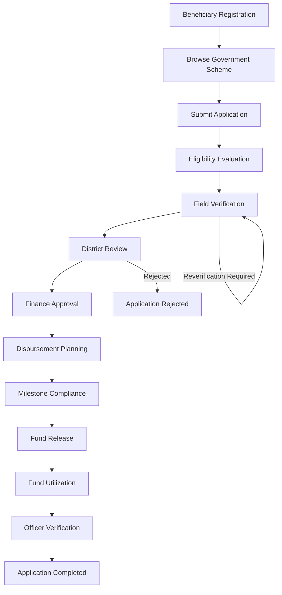

# 🏛️ Government Subsidy & Grant Management System

### End-to-End Digital Platform for Transparent, Secure & Data-Driven Government Fund Distribution

<p align="center">
  <strong>From beneficiary application to verified fund utilization — one complete digital workflow.</strong>
</p>

<p align="center">
  An enterprise-grade full-stack Spring Boot application designed to manage the complete lifecycle of government subsidies and grants through automated eligibility evaluation, multi-level verification, financial approval, staged disbursement, compliance monitoring, and regional analytics.
</p>

<p align="center">


</p>

---

## 📑 Table of Contents

- [Overview](#-overview)
- [Problem Statement](#-problem-statement)
- [Solution](#-solution)
- [Key Features](#-key-features)
- [End-to-End Workflow](#-end-to-end-workflow)
- [User Roles](#-user-roles)
- [Application Lifecycle](#-application-lifecycle)
- [Eligibility Scoring](#-eligibility-scoring)
- [Financial Disbursement](#-financial-disbursement)
- [Fund Utilization](#-fund-utilization)
- [System Architecture](#️-system-architecture)
- [Database Schema](#️-database-schema)
- [Security](#-security)
- [Automated Monitoring](#-automated-monitoring)
- [Reporting & Analytics](#-reporting--analytics)
- [Technology Stack](#️-technology-stack)
- [Project Structure](#-project-structure)
- [Installation & Setup](#-installation--setup)
- [Running Tests](#-running-tests)
- [Demo Roles](#-demo-roles)
- [Project Benefits](#-project-benefits)
- [Future Enhancements](#-future-enhancements)
- [License](#-license)

---

# 📌 Overview

The **Government Subsidy & Grant Management System** is an enterprise-grade application designed to digitize and streamline the complete lifecycle of government subsidy and grant distribution.

The platform manages the journey from:

```text
Beneficiary Registration
        ↓
Scheme Selection
        ↓
Application Submission
        ↓
Eligibility Evaluation
        ↓
Field Verification
        ↓
District Review
        ↓
Finance Approval
        ↓
Disbursement Planning
        ↓
Fund Release
        ↓
Fund Utilization
        ↓
Compliance Verification
        ↓
Application Completion
```

The system combines **Spring Boot, Spring Security, JWT authentication, MySQL, configurable eligibility rules, workflow state management, staged financial disbursement, automated compliance monitoring, and analytics** into a single platform.

---

# 🎯 Problem Statement

Government subsidy programs often involve multiple stakeholders, verification stages, financial approvals, and compliance requirements.

Without a centralized digital workflow, organizations may face challenges such as:

- Manual application processing
- Inconsistent eligibility decisions
- Delayed field verification
- Difficult tracking of application status
- Lack of financial transparency
- Delayed fund utilization verification
- Limited auditability
- Difficulty monitoring overdue milestones
- Fragmented regional performance data

The system addresses these challenges by creating a **controlled, traceable, and role-based digital lifecycle** for every subsidy application.

---

# 💡 Solution

The platform provides a centralized workflow where every application moves through predefined stages.

### Core principle

> **Every application, decision, verification, payment, and utilization event should be traceable throughout its lifecycle.**

The platform provides:

- 👤 Beneficiary management
- 🏛️ Scheme management
- 🧮 Automated eligibility scoring
- 🔍 Multi-level verification
- 💰 Financial approval
- 📑 Staged disbursement
- ✅ Milestone compliance
- 🏦 DBT gateway simulation
- 📊 Fund utilization tracking
- 📈 Regional analytics
- 🚨 Automated monitoring
- 📝 Audit logging
- 📄 CSV reporting

---

# ✨ Key Features

## 👤 1. Beneficiary Management

Beneficiary profiles contain:

- Identity information
- Aadhaar validation
- Category
- Income
- Land holding
- Disability information
- KYC status
- Bank account metadata

Supported beneficiary categories include:

```text
GENERAL
OBC
SC
ST
EWS
```

---

## 🏛️ 2. Government Scheme Management

Administrators can configure subsidy schemes with:

- Scheme code
- Department
- Total budget
- Remaining budget
- Minimum grant amount
- Maximum grant amount
- Minimum eligibility score
- Configurable eligibility criteria

This allows different schemes to use different eligibility rules.

---

# 🧮 3. Configurable Eligibility Scoring

The system evaluates beneficiaries using a configurable scoring engine.

Evaluation can consider:

- Income
- Age
- Category
- Land holding
- Disability

Each criterion can have:

- Comparison operator
- Expected value
- Weight/points
- Mandatory flag

Supported comparison operators include:

```text
<=
>=
==
IN
```

This allows administrators to modify scheme rules without redesigning the entire workflow.

---

# 🔍 4. Multi-Level Verification

Applications pass through multiple verification levels.

```text
Eligibility Evaluation
        ↓
Field Verification
        ↓
District Review
        ↓
Finance Approval
```

Each verification stage can record:

- Decision
- Remarks
- Verification status
- Responsible officer

---

# 🚦 5. Risk Classification

Applications are categorized according to their risk and financial characteristics.

### LOW

Normal applications with acceptable eligibility scores.

### FLAGGED

Borderline applications requiring additional attention.

### HIGH_VALUE

Applications where the grant amount is:

```text
≥ ₹5,00,000
```

These classifications help officers prioritize cases that require additional scrutiny.

---

# 💰 6. Staged Disbursement

Approved grants can be distributed through multiple stages instead of releasing the entire amount at once.

Example:

```text
Grant Approval
      ↓
Milestone 1
      ↓
Compliance Check
      ↓
Fund Release
      ↓
Milestone 2
      ↓
Compliance Check
      ↓
Fund Release
      ↓
Final Milestone
```

Funds cannot be released until mandatory milestone conditions are satisfied.

---

# 🏦 7. DBT / Treasury Integration Simulation

The platform includes an integration-ready simulation of a Treasury DBT gateway.

Fund releases maintain:

- Transaction references
- UTR numbers
- Payment mode
- Treasury status
- Released amount

This models how an actual government financial integration could interact with the system.

---

# 📊 8. Fund Utilization Tracking

The platform tracks how much of the released grant has actually been utilized.

The utilization percentage is calculated as:

```text
Utilization % = (Utilized Amount / Released Amount) × 100
```

Beneficiaries can submit:

- Expenditure details
- Receipts
- Proof documents

Officers can then verify the submitted utilization.

---

# 🧾 9. Complete Audit Trail

The system maintains an immutable audit trail covering:

- Application status changes
- Verification decisions
- Financial approvals
- Fund releases
- Utilization actions
- Other lifecycle transitions

This improves accountability and traceability.

---

# 🚨 10. Automated Compliance Monitoring

Scheduled background processes monitor:

- Overdue milestones
- Unutilized funds
- Compliance issues

Spring's `@Scheduled` mechanism is used for automated monitoring.

---

# 📄 11. Reporting

The system supports CSV report exports for:

- Schemes
- Regions
- Applications
- Milestones
- Fund utilizations

This allows operational data to be extracted for analysis and administrative reporting.

---

# 🔄 End-to-End Workflow



---

# 🔄 Application Lifecycle

Every subsidy application follows a controlled state machine.

```text
DRAFT
  ↓
SUBMITTED
  ↓
ELIGIBILITY_EVALUATED
  ↓
FIELD_VERIFICATION
  ↓
DISTRICT_REVIEW
  ↓
FINANCE_APPROVAL
  ↓
DISBURSEMENT_PLANNED
```

Additional states include:

```text
REVERIFICATION_REQUIRED
REJECTED
COMPLETED
```

This ensures that applications cannot arbitrarily skip required stages.

---

# 👥 User Roles

The system implements role-based authorization.

| Role | Primary Responsibility |
|---|---|
| 👑 Admin | Scheme configuration, budgets, criteria, analytics and audit |
| 👤 Beneficiary | Browse schemes, apply, upload documents and submit utilization |
| 🔍 Field Officer | Ground verification and applicant inspection |
| 🏢 District Officer | District review, approval, rejection and escalation |
| 💰 Finance Officer | Financial approval, disbursement planning and fund release |

---

# 🏛️ System Architecture

```text
                    ┌─────────────────────────────┐
                    │       Web Dashboard         │
                    │                             │
                    │ Admin / Beneficiary /       │
                    │ Officer Interfaces          │
                    └──────────────┬──────────────┘
                                   │
                                   ▼
              ┌───────────────────────────────────────┐
              │           Spring Boot Backend          │
              │                                       │
              │ Controllers                           │
              │        ↓                              │
              │ Services                              │
              │        ↓                              │
              │ Repositories                          │
              │        ↓                              │
              │ JPA / Hibernate                       │
              └─────────────────┬─────────────────────┘
                                │
               ┌────────────────┴────────────────┐
               │                                 │
               ▼                                 ▼
      ┌─────────────────┐              ┌─────────────────┐
      │ Spring Security  │              │   Scheduler     │
      │                  │              │                 │
      │ JWT              │              │ Compliance      │
      │ RBAC             │              │ Monitoring      │
      │ BCrypt           │              │ Alerts          │
      └─────────────────┘              └─────────────────┘
                                │
                                ▼
                       ┌─────────────────┐
                       │      MySQL      │
                       │                 │
                       │ 14 Normalized   │
                       │ Tables          │
                       └─────────────────┘
```

---

# 🗄️ Database Schema

The system uses **14 normalized database tables**.

| Table | Purpose |
|---|---|
| `users` | User credentials and account information |
| `roles` | Role definitions |
| `user_roles` | User-role relationship |
| `regions` | Regional jurisdictions and budgets |
| `beneficiaries` | Beneficiary identity and financial metadata |
| `schemes` | Government scheme configuration |
| `eligibility_criteria` | Configurable eligibility rules |
| `subsidy_applications` | Application lifecycle and scores |
| `application_documents` | Verification documents |
| `verifications` | Field, district and finance verification |
| `disbursement_plans` | Approved financial plans |
| `disbursement_milestones` | Scheduled compliance milestones |
| `fund_releases` | DBT/payment transactions |
| `fund_utilizations` | Expenditure and utilization records |
| `audit_logs` | Lifecycle and financial audit trail |

---

# 🧩 Data Relationship Overview

```text
USER
 │
 ├── ROLE
 │
 └── BENEFICIARY
        │
        ▼
     APPLICATION
        │
        ├──────── DOCUMENTS
        │
        ├──────── VERIFICATIONS
        │
        └──────── DISBURSEMENT PLAN
                       │
                       ├── MILESTONE 1
                       ├── MILESTONE 2
                       └── MILESTONE N
                              │
                              ▼
                         FUND RELEASE
                              │
                              ▼
                       FUND UTILIZATION
                              │
                              ▼
                         VERIFICATION
```

---

# 🔐 Security

Security is implemented using **Spring Security with JWT-based authentication**.

## Authentication

The application uses:

```text
JWT Bearer Tokens
```

for stateless authentication.

## Password Security

Passwords are encrypted using:

```text
BCrypt
```

## Role-Based Authorization

The system supports:

```text
ROLE_BENEFICIARY
ROLE_FIELD_OFFICER
ROLE_DISTRICT_OFFICER
ROLE_FINANCE_OFFICER
ROLE_ADMIN
```

Each role receives access according to its responsibilities.

---

# ⏰ Automated Monitoring

The application includes scheduled compliance monitoring.

The scheduler identifies:

### Overdue Milestones

```text
Milestone Due Date
       ↓
Due Date Passed
       ↓
Compliance Monitor
       ↓
Flag Application
```

### Unutilized Funds

The system can identify released funds that have not been appropriately utilized.

This helps officers focus on cases requiring attention.

---

# 📈 Analytics

The platform provides regional and scheme-level analytics.

Potential operational views include:

- Scheme budgets
- Regional allocations
- Approved amounts
- Released amounts
- Utilized amounts
- Remaining balances
- Application counts
- Application status distribution
- Milestone progress

This enables decision-makers to understand how government funds are being distributed and utilized.

---

# 🛠️ Technology Stack

| Layer | Technology |
|---|---|
| Backend | Spring Boot |
| Language | Java 17+ / Java 21 LTS |
| Security | Spring Security |
| Authentication | JWT |
| Password Hashing | BCrypt |
| Database | MySQL 8.x |
| ORM | JPA / Hibernate |
| Database Connectivity | JDBC |
| Connection Pool | HikariCP |
| Build Tool | Maven |
| Scheduling | Spring `@Scheduled` |
| Reporting | CSV Export |
| Frontend | Embedded Web Dashboard |

---

# 📁 Project Structure

A typical Spring Boot structure for the application can be organized around:

```text
src/
└── main/
    ├── java/
    │   └── ...
    │       ├── controller/
    │       ├── service/
    │       ├── repository/
    │       ├── entity/
    │       ├── dto/
    │       ├── security/
    │       ├── config/
    │       ├── scheduler/
    │       └── exception/
    │
    └── resources/
        ├── application.properties
        └── ...
```

> The exact package structure should follow the implementation present in the repository.

---

# 🚀 Installation & Setup

## Prerequisites

Install the following:

```text
Java 17+ 
Maven 3.9+
MySQL 8.x
```

Java 21 LTS is recommended.

The project also supports an **H2 in-memory profile** for zero-setup execution.

---

# 🗄️ MySQL Configuration

### 1. Start MySQL

Make sure MySQL is running on:

```text
localhost:3306
```

### 2. Create the database

```sql
CREATE DATABASE subsidy_db
CHARACTER SET utf8mb4
COLLATE utf8mb4_unicode_ci;
```

### 3. Configure application properties

Update:

```text
src/main/resources/application.properties
```

Example:

```properties
spring.datasource.url=jdbc:mysql://localhost:3306/subsidy_db?useSSL=false&allowPublicKeyRetrieval=true&serverTimezone=UTC
spring.datasource.username=root
spring.datasource.password=your_password
```

---

# ▶️ Run the Application

## Using MySQL

From the project root:

```bash
mvn spring-boot:run
```

---

## Using H2

After building the application:

```bash
mvn clean package
```

Then:

```bash
java -jar target/government-subsidy-system-1.0.0.jar --spring.profiles.active=h2
```

The H2 profile provides a convenient way to run the application without configuring MySQL.

---

# 🌐 Access the Dashboard

Once the application starts, open:

```text
http://localhost:8080/
```

The project includes an embedded web dashboard with a **1-Click Quick Demo Role Switcher**, allowing users to switch between supported demonstration roles.

---

# 👤 Demo Roles

The original project provides demonstration credentials for the major system roles.

| Role | Username |
|---|---|
| Admin | `admin` |
| Beneficiary | `farmer_john` |
| Beneficiary 2 | `artisan_priya` |
| Field Officer | `field_officer1` |
| District Officer | `district_officer1` |
| Finance Officer | `finance_officer1` |

> ⚠️ The credentials in the source README are demo credentials. For any real deployment, replace them and never commit production passwords to the repository.

---

# 🧪 Running Tests

Run the complete test suite using:

```bash
mvn test
```

The project documentation reports **20 unit and integration tests** covering:

- Authentication
- Eligibility evaluation
- Workflow state transitions
- Staged disbursement
- Milestone compliance
- Fund utilization

---

# 🔁 Example Application Journey

Consider a beneficiary applying for a government agricultural subsidy.

```text
1. Beneficiary registers
        ↓
2. Selects eligible scheme
        ↓
3. Submits application
        ↓
4. System calculates eligibility score
        ↓
5. Field Officer performs verification
        ↓
6. District Officer reviews application
        ↓
7. Finance Officer approves funding
        ↓
8. Disbursement plan is created
        ↓
9. Beneficiary completes milestone
        ↓
10. Compliance is verified
        ↓
11. Funds are released through DBT
        ↓
12. Beneficiary submits utilization proof
        ↓
13. Officer verifies expenditure
        ↓
14. Application becomes COMPLETED
```

---

# 📊 Project Benefits

## 🏛️ For Government Administrators

- Centralized scheme management
- Budget monitoring
- Regional analytics
- Complete audit trail
- Automated compliance monitoring

## 👤 For Beneficiaries

- Easier scheme discovery
- Digital application submission
- Application status tracking
- Document submission
- Utilization reporting

## 🔍 For Field Officers

- Structured verification workflow
- Applicant inspection
- Reverification management
- Centralized records

## 🏢 For District Officers

- District-level application review
- Approval/rejection workflow
- Escalation handling
- Regional visibility

## 💰 For Finance Officers

- Financial approval management
- Disbursement planning
- Milestone-based fund release
- Treasury/DBT transaction tracking

---

# 🔮 Future Enhancements

Potential improvements for a production-scale deployment include:

- 📱 Dedicated mobile application for beneficiaries
- 🔐 Aadhaar/identity verification API integration
- 🏦 Real Treasury/PFMS integration
- 💳 Real DBT payment gateway integration
- 📧 Email and SMS notifications
- 🔔 Real-time application alerts
- 📊 Advanced BI dashboards
- 🤖 AI-assisted fraud/risk detection
- 🧠 Predictive beneficiary eligibility analysis
- 🗺️ GIS-based regional analytics
- 📄 Digital document OCR
- 🔎 Duplicate beneficiary detection
- 🧾 Automated document verification
- ☁️ Cloud deployment
- 🐳 Docker containerization
- 🔄 CI/CD pipeline
- 📜 Digital signatures for approvals

---

# 🏆 What Makes This Project Different?

The system is not simply a **CRUD application for government schemes**.

It models an actual administrative and financial lifecycle:

```text
DATA
 ↓
ELIGIBILITY
 ↓
VERIFICATION
 ↓
DECISION
 ↓
FINANCIAL APPROVAL
 ↓
DISBURSEMENT
 ↓
COMPLIANCE
 ↓
UTILIZATION
 ↓
AUDIT
```

The combination of **workflow state management + configurable eligibility scoring + role-based authorization + staged financial controls + automated compliance monitoring + auditability** makes it suitable as a strong enterprise-style software engineering project.

---

# 📌 Project Highlights

```text
✓ Full-stack Spring Boot Application
✓ JWT Authentication
✓ Role-Based Access Control
✓ Configurable Eligibility Engine
✓ Multi-Level Verification Workflow
✓ Staged Disbursement
✓ Milestone Compliance
✓ DBT/Treasury Simulation
✓ Fund Utilization Tracking
✓ Regional Analytics
✓ Automated Scheduled Monitoring
✓ CSV Reporting
✓ Immutable Audit Trail
✓ MySQL Integration
✓ H2 Zero-Setup Profile
✓ Unit & Integration Testing
```

---

# 📄 License

This project is developed as an **enterprise-style government subsidy and grant management system** for academic, demonstration, and software engineering purposes.

Refer to the repository's licensing terms for usage and distribution details.

---

<p align="center">

### 🏛️ Government Subsidy & Grant Management System

<strong>Transparent processes. Controlled disbursements. Accountable outcomes.</strong>

<br><br>

Built with ❤️ using Spring Boot, Spring Security, JWT, MySQL and modern enterprise software engineering practices.

</p>